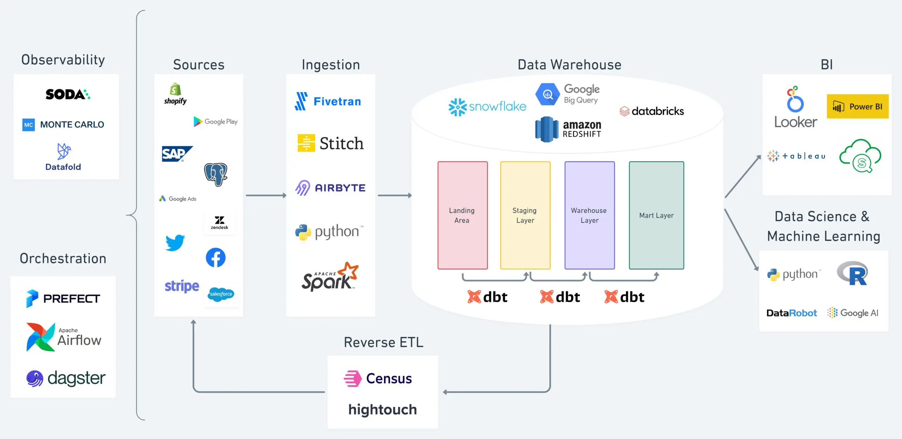

# Marketing Performance Analysis

End-to-end analytics stack to analyze marketing performance for the **Maven Fuzzy Factory** e-commerce dataset. The project ingests CSVs with **DLT**, transforms with **dbt**, orchestrates with **Dagster**, and surfaces **KPIs** consumable in **Metabase**.

## Business Questions Covered
- Trends in sessions and orders
- Session-to-order conversion rate
- Performance by acquisition channel (utm_source)
- Revenue, gross margin, and refunds
- Revenue per order and per session

## Architecture (High Level)
```
CSV (data/)
  → DLT ingestion → Snowflake (raw)
  → dbt (staging → intermediate → marts)
  → KPIs + tests + Elementary report
  → Metabase dashboard
```

## Modern Data Stack Diagram


## Stack
- Ingestion: `dlt` + `polars`
- Transformation: `dbt-core` + `dbt-snowflake`
- Orchestration: `dagster` + `dagster-dbt`
- Data Quality: `dbt tests` + `elementary-data`
- BI: `Metabase`
- Warehouse: `Snowflake`

## Repository Structure
- `data/` – raw CSVs + data dictionary (`maven_fuzzy_factory_data_dictionary.csv`)
- `ingestion/` – DLT pipeline (CSV → Snowflake `raw`)
- `dbt_marketing_perf/` – dbt project (staging, intermediate, marts, tests, exposures)
- `infra/` – Dagster orchestration + ops scripts
- `dashboard/` – Metabase dashboard export (PDF)
- `docs/` – user guide, runbook, optimization notes

## Data Model (dbt)
- **Staging**: source normalization (`stg_*`)
- **Intermediate**: business joins (`int_*`)
- **Marts**:
  - **Core**: `fct_sessions`, `fct_orders`, `fct_order_items`, `fct_refunds`, `dim_products`, `dim_users`
  - **KPIs**: `kpi_daily_overview`, `kpi_daily_marketing_channels`

KPI marts are **incremental** with a rolling 3‑day recompute window to keep data fresh.

## Prerequisites
- Python 3.10+
- Snowflake access (account, warehouse, database)
- `dbt` and `dagster` installed via `requirements.txt`

## Configuration
Snowflake environment variables used by dbt (see `dbt_marketing_perf/profiles.yml`):
- `SNOWFLAKE_ACCOUNT`
- `SNOWFLAKE_USER`
- `SNOWFLAKE_PASSWORD`
- `SNOWFLAKE_ROLE`
- `SNOWFLAKE_DATABASE`
- `SNOWFLAKE_WAREHOUSE`

Notes:
- DLT reads its configuration from `ingestion/.dlt/` (or `infra/.dlt/` when orchestrated).
- `ingestion/filesystem_pipeline.py` uses an absolute path to `data/`. Update `DATA_PATH` if the repo moves.

## Quick Start (Local)
```bash
python3 -m venv .venv
source .venv/bin/activate
pip install -r requirements.txt

# DLT ingestion
python ingestion/filesystem_pipeline.py

# dbt build + tests
cd dbt_marketing_perf
DBT_PROFILES_DIR=. dbt deps
DBT_PROFILES_DIR=. dbt build

# dbt docs
DBT_PROFILES_DIR=. dbt docs generate
DBT_PROFILES_DIR=. dbt docs serve

# Elementary report (HTML)
./infra/elementary/run_report.sh
```

## Dagster Orchestration
- **Ingestion job**: `dlt_pipeline_job`
- **Transformation job**: `dbt_build_job` (auto-triggered after successful DLT run)
- **Schedule**: daily at 06:00 UTC

Start the Dagster UI:
```bash
cd infra
DAGSTER_HOME=$(pwd)/.dagster dagster dev -w dagster_project/workspace.yaml
```

## Metabase Dashboard
- PDF export: `dashboard/Metabase - MARKETING PERFORMANCE DASHBOARD.pdf`
- dbt exposure: `marketing_kpis_dashboard` (default local URL in `dbt_marketing_perf/models/exposures.yml`)

## Quality & Monitoring
- Constraints and relationship tests in `schema.yml`
- Freshness/anomaly monitoring via **Elementary**
- Dagster sensors to trigger dbt and alert on failures

## Useful Docs
- `docs/user_guide.md` – daily workflow
- `docs/ops_optimization.md` – Snowflake optimization recommendations
- `docs/kt_checklist.md` – handover checklist

## Recommended Run Order
1. DLT ingestion
2. `dbt build` + tests
3. Generate the Elementary report
4. Review the Metabase dashboard

---
